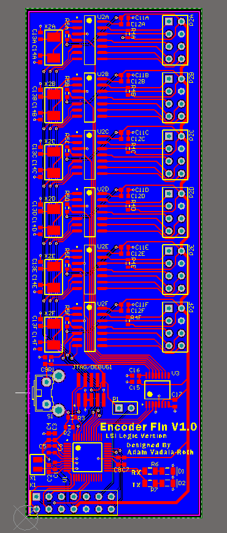
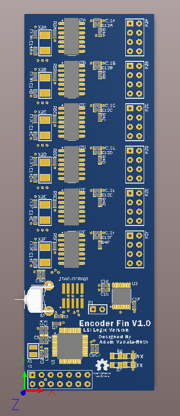

EncoderFin
==========

A TinyG Kinen Fin that allows for the use of quadrature encoders on all 6 axes. 

Model B
=======

Specifications:
- FreeScale MKL05Z32VLF4 ARM Cortex M0+ 48MHZ
- ARM Cortex M JTAG port supporting serial wire debugging
- Compatible with the previous Kinen specification and the recently updated specifiation.
- (3x) AR< Cprtex ML0516VLF4 ARM Cortex M0+ 48MHZ QFN 24 for Encoder processing

Encoder Fin Model B Rev 1 PCB 2D Rendering

Encoder Fin Model B Rev 1 PCB 3D Rendering

Model A
=======

Specifications:
- FreeScale MKL05Z32VLF4 ARM Cortex M0+ 48MHZ
- ARM Cortex M JTAG port supporting serial wire debugging
- Compatible with the previous Kinen specification and the recently updated specifiation.
- (6x) LSI/CSI LS7366R Quadrature Decoder (encoder counters/processors).

Encoder Fin Model A Rev 1 PCB 2D Rendering

Encoder Fin Model A Rev 1 PCB 3D Rendering

